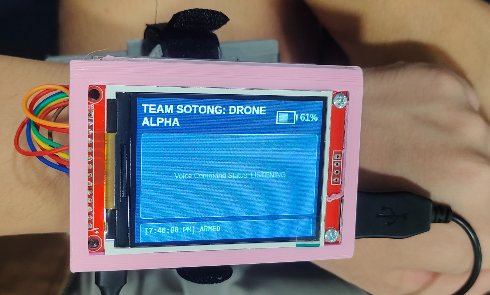

# Wearable Interface
GUI Interface for Wearable 

Designed for a TFT screen of 320x240 running on a Raspberry Pi 



## Setup
### TFT Screen Setup

### Kiosk Mode with Chromium
```chromium-browser --kiosk --start-fullscreen --window-size=320,240 --force-device-scale-factor=1.0 127.0.0.1:8080```

Uses MJPEG streaming with HTTP endpoint for web interface

## To run:
For full running system:

```./open_ui.sh```

For testing of voice control system:

```./open_voice_control.sh```

## For testing only:
For testing the camera with a loopback IP on a Rasp Pi:
```
rpicam-vid -t 0 -n --width 320 --height 240 --vflip --sharpness 2.0 --codec mjpeg --quality 100 --inline -o - |   gst-launch-1.0 fdsrc fd=0 !   jpegparse !   udpsink host=127.0.0.1 port=5000
```
With another terminal:
```
gst-launch-1.0 udpsrc port=5000 ! application/x-rtp ! rtph264depay ! h264parse ! avdec_h264 ! videoconvert ! jpegenc ! multipartmux ! tcpserversink host=0.0.0.0 port=8090
```

## Things to Note:

1. **Change IP address of drone where appropriate**
2. 

## TODO
1. ~~Enable camera streaming from Jetson to UI (look into webrtc)~~
2. Add actual data (battery, mode etc) from drone to UI (possibly through subscription of topic in mavros on drone to UDP to UI)
3. Tune colour and resolution of screen 